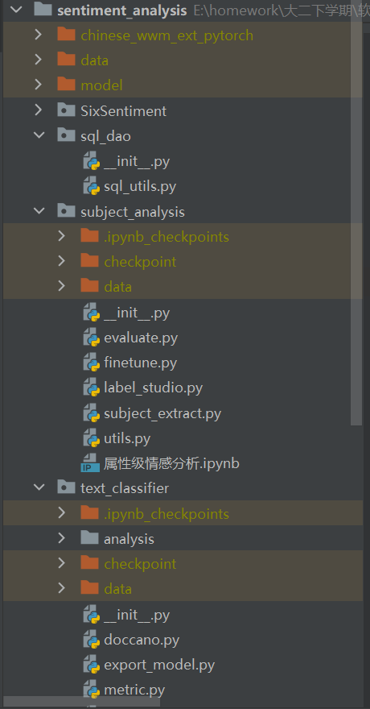

# sentiment_analysis
情感分析和主题分析
* 模型和数据文件需要额外下载
  * chinese_wwm_ext_pytorch
  * data
  * model
  * subject_analysis
    * checkpoint
    * data
  * text_classifier
    * checkpoint
    * data

* 完整的项目结构如下
* 
